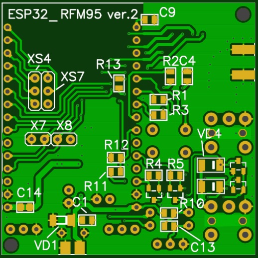
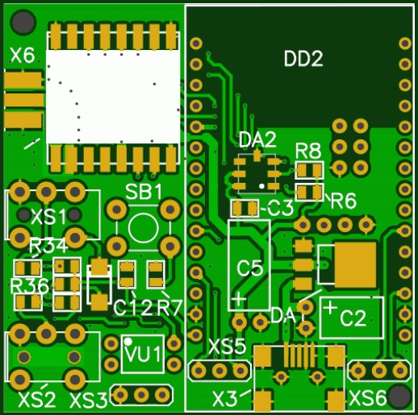
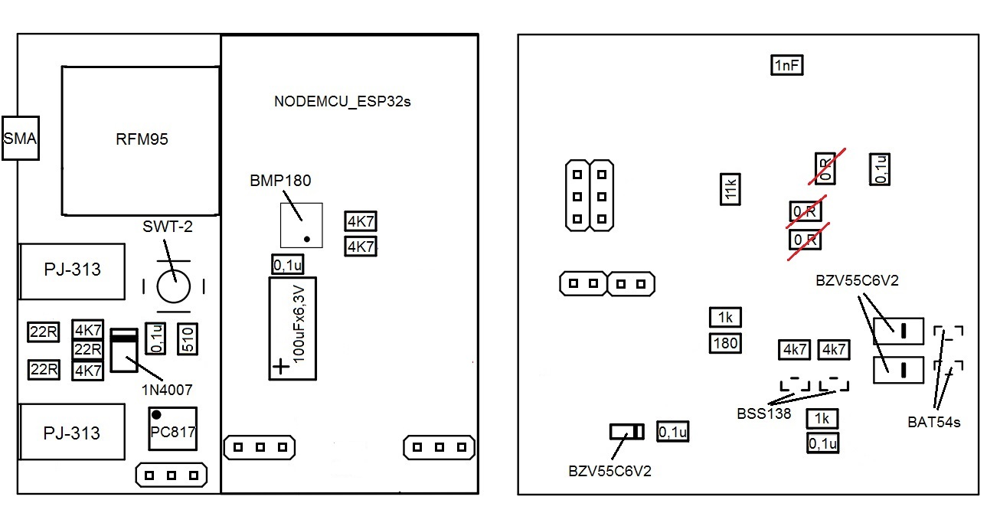
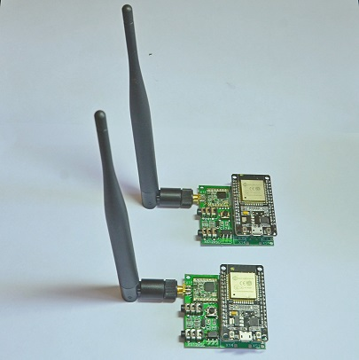

Беспроводной датчик температуры 868МГц (LoRa-модуль RFM95 + ESP32 Node MCU)
=============================================================
Здесь представлен проект беспроводного устройства измерения температуры и влажности на основе LoRa-модуля RFM95 и платы ESP32 Node MCU.

Отличительной особенностью применения радиомодулей RFM95 является существенное увеличение дальности передачи радиопакетов за счет расширения спектра передаваемого сигнала (запатентованная модуляция LoRa). Дальность передачи может достигать 1-3 км в городской застройке и более 4-5 км на открытой местности.

Функциональная схема беспроводного устройства представлена ниже:

В состав устройства помимо названных модулей входит датчик атмосферного давления BMP180, схема преобразования логических уровней 5В <--> 3,3В для подключения внешних датчиков DS18B20 и AM2302, один оптоизолированный цифровой вход и кнопка для перевода устройства в режим настройки. 

Внешний вид печатной платы представлен на рисунках:

Необходимые для производства плат gerber-файлы и файл сверловки отверстий можно скачать [тут](https://github.com/maksms/wifi-iot-cda/blob/master/rapid/lora/ESP32_RFM95V2.rar) 

Заказать изготовление плат можно например на сайте [www.jlcpcb.com](http://www.jlcpcb.com)

Монтаж радиоэлементов выполнять по следующему чертежу:

В результате получим вот такие устройства:

Теперь останется только их запрограммировать

